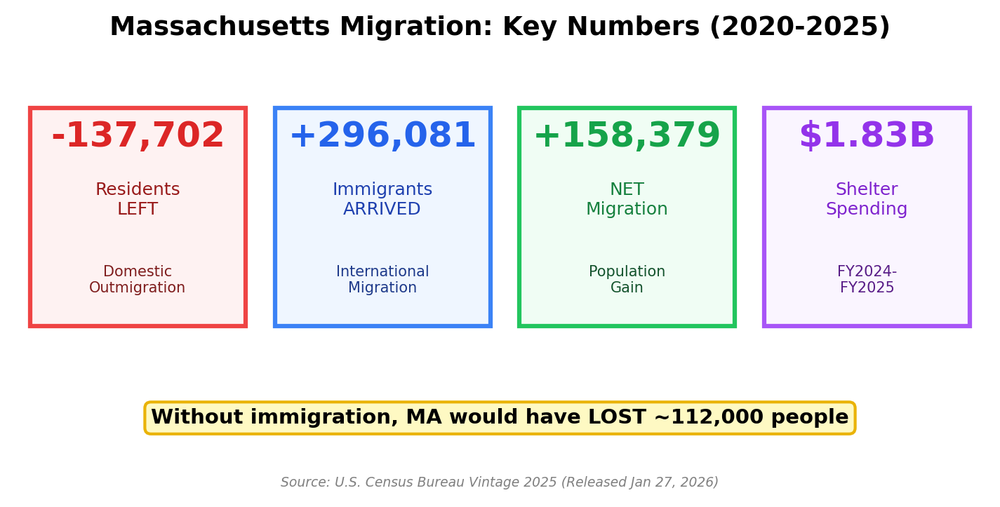
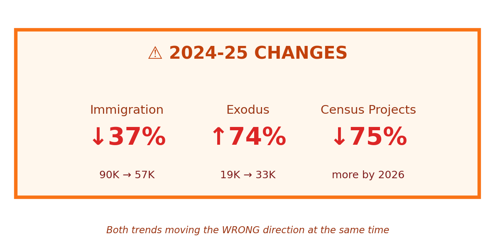
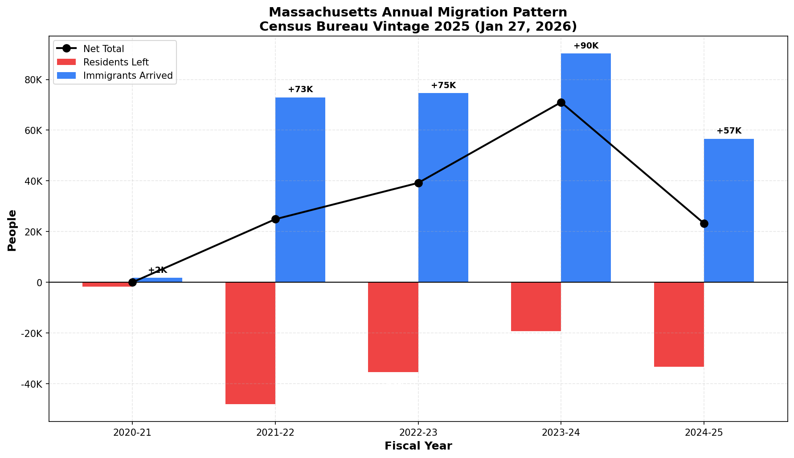
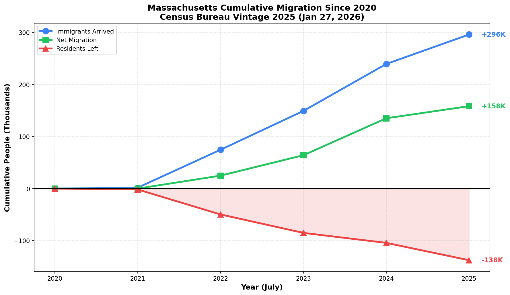
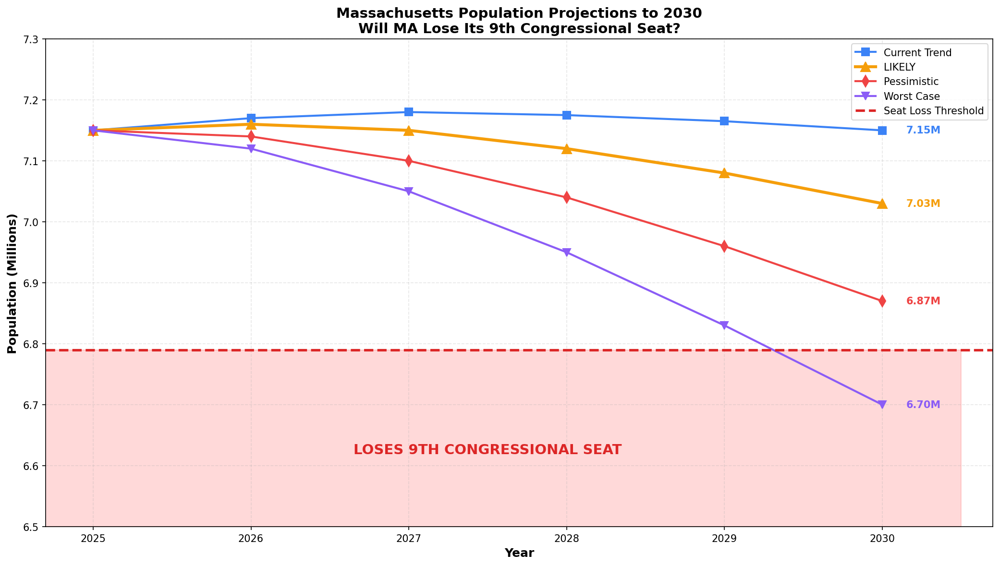

# Massachusetts Migration Analysis Dashboard

**Interactive visualization of Massachusetts migration patterns using Census Bureau Vintage 2025 data (released January 27, 2026)**

## 🔗 [View Live Dashboard](https://duncanburns2013-dot.github.io/Immigration/)

---

## 📊 Key Findings



### The Massachusetts Paradox

Since 2020, Massachusetts has experienced a **mass exodus** of residents to other states — but you wouldn't know it from the population numbers. Why? **Immigration**.

| Metric | Value |
|--------|-------|
| Residents LEFT for other states | **-137,702** |
| Immigrants ARRIVED | **+296,081** |
| Net Migration | **+158,379** |
| Emergency Shelter Spending | **$1.83 Billion** |

**Without immigration, Massachusetts would have LOST approximately 112,000 people since 2020.**

---

## ⚠️ 2024-25: The Trends Reverse



The latest Census data reveals a dramatic shift:

| Change | 2023-24 | 2024-25 | Shift |
|--------|---------|---------|-------|
| Immigration | 90,217 | 56,600 | **↓37%** |
| Domestic Exodus | -19,200 | -33,340 | **↑74%** |

**Both trends are now moving in the wrong direction simultaneously.**

The Census Bureau projects national immigration will drop another **75% by July 2026** due to policy changes.

---

## 📈 Annual Migration Pattern



### Year-by-Year Data

| Period | Residents Left | Immigrants Arrived | Net |
|--------|---------------|-------------------|-----|
| 2020-21 | -1,762 | +1,762 | 0 |
| 2021-22 | -48,000 | +72,892 | +24,892 |
| 2022-23 | -35,400 | +74,610 | +39,210 |
| 2023-24 | -19,200 | +90,217 | +71,017 |
| 2024-25 | -33,340 | +56,600 | +23,260 |
| **TOTAL** | **-137,702** | **+296,081** | **+158,379** |

---

## 📉 Cumulative Impact Since 2020



The three lines tell the story:
- 🔵 **Blue line (+296K)**: Immigrants who arrived
- 🟢 **Green line (+158K)**: Net migration gain  
- 🔴 **Red line (-138K)**: Residents who left

The gap between blue and green = the exodus that immigration covered.

---

## 🔮 2030 Projections: Congressional Seat at Risk



If Massachusetts population drops below **~6.79 million** by 2030, it loses its **9th Congressional seat**.

| Scenario | 2030 Population | Loses Seat? |
|----------|-----------------|-------------|
| Current Trend | 7.15M | No |
| **LIKELY** | **7.03M** | **Close** |
| Pessimistic | 6.87M | **YES** |
| Worst Case | 6.70M | **YES** |

### Scenario Assumptions

- **Current Trend**: Immigration and exodus rates stabilize at 2024-25 levels
- **LIKELY**: Immigration continues declining per Census projections
- **Pessimistic**: Census projection plays out fully (75% immigration drop)
- **Worst Case**: Deportations + H1B visa cuts + accelerated exodus

---

## ❓ Why Are Residents Leaving?


### BU Finance Study (2024) - Top Factors:

1. **Taxes** (100) — MA ranks **43rd out of 50** in tax competitiveness
2. **Housing Costs** (95)
3. **Healthcare Expenses** (85)
4. **Traffic** (70)

### Economist Klepper-Smith's "Four T's"

1. **Taxes**
2. **Temperature**
3. **Traffic**
4. **Targeting** (of blue states for federal spending cuts)

*Note: Klepper-Smith himself moved to South Carolina*

---

## 🔄 The Vicious Cycle

```
High taxes → Residents leave → Immigration replaces them → 
$1.83B on shelters → More taxes → More residents leave → 🔄
```

### The Irony

Massachusetts spent **$1.83 billion** on emergency immigrant shelters (FY2024-FY2025).

Those immigrants were the **only reason** the state's population grew.

Now immigration is dropping while the exodus accelerates.

---

## 📁 Repository Contents

| File | Description |
|------|-------------|
| `index.html` | Interactive dashboard (5 tabs) |
| `migration_data.json` | Raw data in JSON format |
| `img_key_metrics.png` | Summary infographic |
| `img_2024_changes.png` | Warning banner graphic |
| `img_annual_migration.png` | Annual bar chart |
| `img_cumulative_migration.png` | Cumulative line chart |
| `img_2030_projection.png` | Projection scenarios |
| `img_why_leave.png` | Exodus reasons chart |

---

## 🛠️ Dashboard Features

The [interactive dashboard](https://duncanburns2013-dot.github.io/Immigration/) includes:

- **📊 Overview** — Key metrics and "The Massachusetts Paradox" summary
- **📅 Annual** — Year-by-year data table and chart
- **📈 Cumulative** — Running totals since 2020
- **🔮 2030** — Population projections with seat loss threshold
- **❓ Why Leave** — BU Study findings and the "Four T's"

---

## 📚 Data Sources

| Source | Description |
|--------|-------------|
| [Census Bureau Vintage 2025](https://www.census.gov/newsroom/press-releases/2026/population-growth-slows.html) | Population estimates released Jan 27, 2026 |
| [Census Bureau Blog](https://www.census.gov/newsroom/blogs/random-samplings/2026/01/historic-decline-in-net-international-migration.html) | Methodology on immigration projections |
| [IRS SOI Migration Data](https://www.irs.gov/statistics/soi-tax-stats-migration-data) | State-to-state migration flows |
| [Tax Foundation](https://taxfoundation.org/research/all/state/2024-state-business-tax-climate-index/) | State tax competitiveness rankings |
| BU Finance Study (2024) | Survey on outmigration drivers |

---

## ⚠️ Caveats

- Census methodology includes estimates and periodic revisions
- 2023-24 outmigration was revised **DOWN 32%** in Vintage 2025
- State-level data is distributed by formula from national totals
- Projections are **scenarios**, not predictions
- Seat loss threshold (~6.79M) is approximate based on apportionment formulas

---

## 📄 License

MIT License - Feel free to use, modify, and share.

---

## 🔗 Links

- **Live Dashboard**: https://duncanburns2013-dot.github.io/Immigration/
- **Repository**: https://github.com/duncanburns2013-dot/Immigration

---

*Data compiled January 31, 2026*
